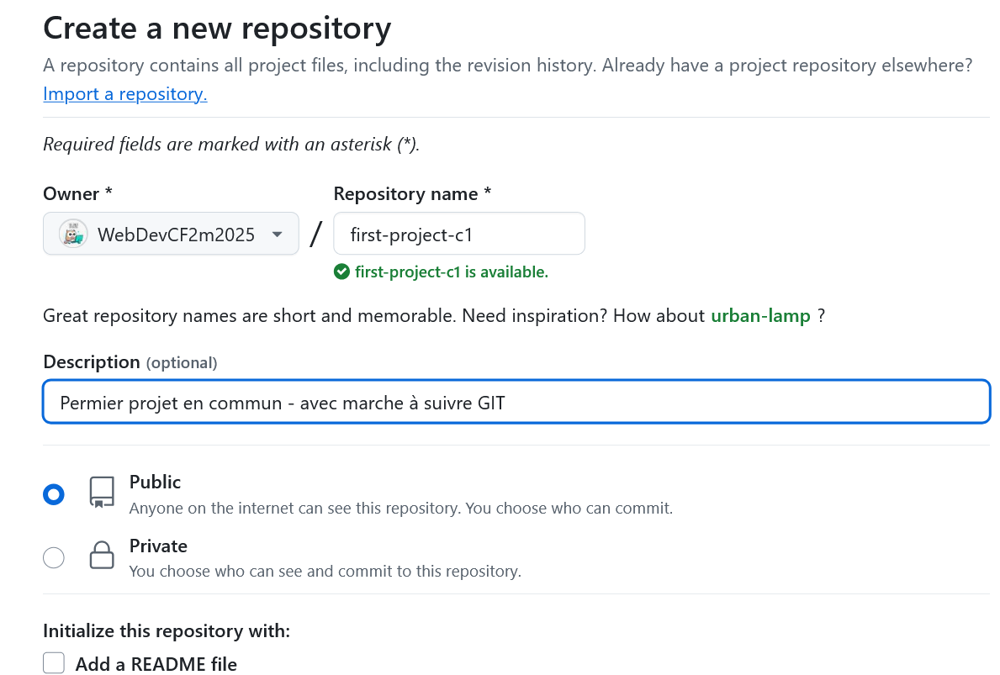

# first-project-c2

## Création d'un projet en local via git

Dans le projet de travail sur notre ordinateur, `first-proj-c1`, nous avons créé un fichier `README.md` et un dossier `img` qui contiendra des captures d'écran.

Si on fait un `git status` nous obtenons l'erreur : `fatal: not a git repository (or any of the parent directories): .git`

### Création d'un dépôt `git` 

Ouvrez la console et tapez :

```bash
git init
```

Un dossier caché est cré, il se nomme `.git`. C'est lui qui va contenir les fichiers et l'historique de travail. Ce fichier `.git` ne devra pas être envoyé via `FTP`.

Pour l'exemple, on va créer un dossier `test` vide:

Lorsque l'on fait un `git status`, on constate le dossier `test` n'est pas reconnu. Les dossiers vides ne sont reconnus !

## Les zones


### Zone de `working`

Ouvrez la console et tapez :

```bash
git status
```

Lorsque le texte après un `git status` est en **rouge**, c'est que `git` les a détectés, mais qu'ils ne sont pas mis dans la future sauvegarde.

### Zone de `staging`

Nous allons utiliser `git add` pour ajouter les fichiers au staging :

```bash
# ajoute un seul fichier
git add lenomdunfichier.txt

# ajoute tous les fichiers
git add .
```
Pour retirer du `staging`si on a pas encore celui-ci dans un commit :

	git rm --cached nomdufichier.

Pour retirer du `staging` si on a déjà un commit :

	git restore --staged nomdufichier.


Lorsque nous allons refaire un `git status`, les fichiers qui sont prêts à être sauvegardés seront en **vert**, ceux qui ne seront pas envoyés restent en **rouge**


### Zone de `repository local`

Nous allons sauvegarder un fichier en utilisant le `commit` :

```bash
# sauvegarde avec commentaire
git commit -m"First commit with README.md "
```

#### Voir les `commit`

Permet de voir les remotes

### Zone de `repository remote`

Nous allons créer un repository sur github, public ou privé, sans cocher les autres options (il ne doit pas y avoir de commit sur github autres que ceux en local)



Nous devons récupérer le répertoire en `SSH` si nous utilisons l'échange de clef : [Lier avec SSH](https://github.com/WebDevCF2m/prefo-git-c1?tab=readme-ov-file#lier-votre-compte-et-votre-pc) ou en `https`.

Nous retournons dans la console, et nous allons lier le projet local avec le projet distant : 

```bash
# on s'assure que que la branche soit `main`
git branch -M main

# On ajoute notre lien vers le répertoire `github`
git remote add origin git@github.com:WebDevCF2m2025/first-project-c1.git
```

On peut vérifier le lien avec : 

```bash
git remote -v 
```

Nous pouvons maintenant envoyer notre travail en ligne sur `github` : 

```bash
# le -u n'est à mettre que la première fois
# il équivaut à git push --set-upstream origin main
git push -u origin main
```

Nous pourrons ensuite envoyer notre travail sur `origin main` avec :

	git push

## Récuperation du repository 

Pour récupérer simplement un repository, on peut utiliser le clonage (première fois !), dont on est propriétaire (ou un `fork`) : 

```bash
git clone CLEF_SSH (ou https)
cd nom_du_répertoire

# pour voir le remote créé 
git remote -v
```
	
	
Et nous pouvons travailler en local sur le projet.

### Récupération de commit 

Pour récupérer les nouveaux commit ou commit non présents en local (par exemple travail sur plusieurs machines):

```bash
#récupère le dossier .git (vérification de modification)
git fetch

# s'il y a des changements, récupération du dossier .git
# Et des fichiers physiques
git pull 
```

### Retour sur un commit

####On peut revenir sur un ancien commit, sans perdre les changements actuels fichiers

```bash
# on avait envoyé 4 commits en ligne
git push

#retourne sur un ancien commit 
# ! disparition des commit qui suivent
git reset 0901dac84 

# On back 3 commits
# sans modifier les fichiers physiques
# en creant un nouveau commit
git add .
git commit -m"-3 commit + save files"
```

Si on effectue un `git push`on aura une erreur car il y a une incompatibilité de la chaine de commit, une bifurcation. 

**seule posibilitée** : forcer le push :

	git push --force origin main
	
####On peut revenir sur un ancien commit en remettant les fichiers à l'état de ce commit

```bash
# création d'un fichier
echo "blabla" > f.txt
git add .
git commit -m"f.txt"
git push

# création d'un deuxième fichier
echo "blabla2" > f2.txt
git add .
git commit -m"f2.txt"
git push

#retourne sur un ancien commit 
# ! disparition des commit qui suivent
# = disparition fichiers ou modifications de ceux-ci
git reset --hard 0901dac84 

# On back 3 commits
# sans modifier les fichiers physiques
# en creant un nouveau commit
git add .
git commit -m"-3 commit + save files"
```

Si on effectue un `git push`on aura une erreur car il y a une incompatibilité de la chaine de commit, une bifurcation. 

**seule posibilitée** : forcer le push :

	git push --force origin main	
	
## Bonnes pratiques

### Utilisation des branches

Pour voir les branches : 

	git branch

Par défaut nous avons que `main`

Pour créer un branche (à partir de la branche actuelle active)

	git branch nomDeLaBranche
	
Pour accéder à la branche

	git switch nomDeLaBranche
	
Pour retourner sur la main

	git switch main
	
Pour envoyer une branche en ligne

	git push origin nomDeLaBranche
	
Pour supprimer une branche en local
	
	git branch -d nomDeLaBranche
	
Pour supprimer une branche sur github, passez par github (mauvaise pratique)

	